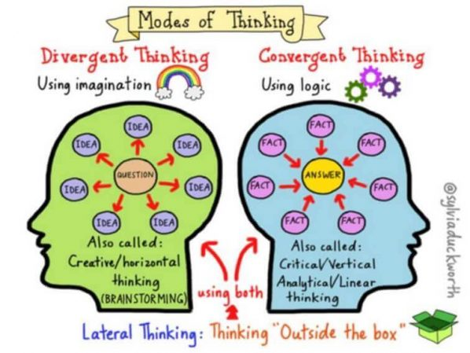
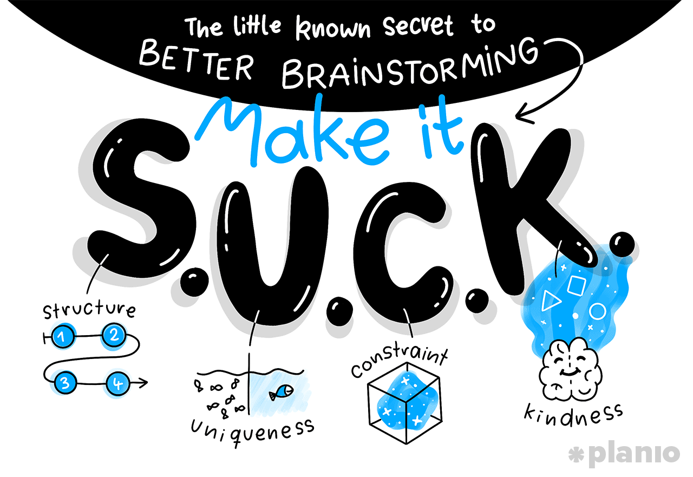

<!-- _backgroundColor: black -->

<!-- _color: white -->
# Hello Brainstorm 

---
# Brainstorming and Ideation
-  Changing Education Paradigms
-  Sir Ken Robinson
- https://www.youtube.com/watch?v=zDZFcDGpL4U
---

---
## Creativity

> 1. **Defer judgment** – separating idea generation from idea selection strengthens both activities.  
> 2. **For now, suspend critique** –  Know that you’ll have plenty of time to evaluate the ideas after the brainstorm.  
> 3. **Encourage wild ideas** – breakout ideas are right next to the absurd ones  
> 4. **Build on the ideas of others** – listen and add to the flow if ideas. This will springboard your group to places no individual can get to on their own.  
> 5. **Go for volume** – the best way to have a good idea is to have lots of ideas  
> 6. **One conversation at a time** – maintain momentum as a group. Save the side conversations for later.  
> 7. **Headline** – capture the essence quickly and move on. Don’t stall the group by going into a long-winded idea.  

---
# Brainstorming Techniques

---

---
# The S.U.C.K. Method

**Structure**: Make your brainstorming sessions mirror the creative process
**Uniqueness**: Brainstorm for questions before you look for solutions
**Constraints**: Keep brainstorming sessions guided, on track, and intentional
**Kindness**: Make psychological safety your primary concern

---
# More Methods

**Question Burst:** “Brainstorming for questions rather than answers makes it easier to push past cognitive biases and venture into uncharted territory. Yet lingering in a questioning mode doesn’t come naturally to most people, because we’re conditioned from an early age to just keep the answers coming.”
**Rapid Iteration:** By pairing rapid ideation with another brainstorming technique called gap analysis will help you turn those ideas into a solid and clear plan forward.

---
# Resources

https://plan.io/blog/brainstorming-techniques/
https://www.mindtools.com/brainstm.html
https://www.ideou.com/pages/brainstorming

---
# Make Constraints
### Make teams of pairs (make a case if you want to be three)

**Expand Green City** - Destroy  Green City (Godzilla when too much energy)
Meet the **new hungry fish** in the aquarium - hunter or prey
Take the bouncing ball and other examples into a game - **multi-player pong**

Work on your ideas (**but make constraints**)
