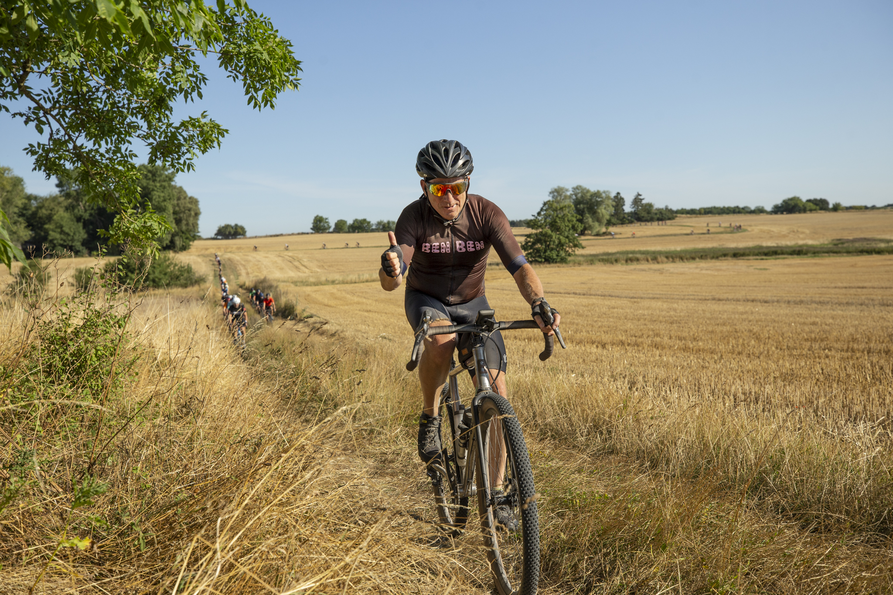

<!-- _backgroundColor: black -->
# Thanks!<!--fit-->
<!-- _color: gold -->

---
# Kickstart-kursus i programmering dag 5

## Daniel Spikol
### ds@di.ku.dk

## DIKU, Københavns Universitet
### 14. august 2025

---

# Today's Plan

- 9.00 - 9.15 Recap
- 9.20 - 9.30 Survey and Thanks!
- 9.30 - 11.45 Project work
- 11.45 - 12.30 Lunch
- 12.30 - 13.00 Final prep
- 13.00 - 13.30 Show and Talk Session Delta
- 13.30 - 14.00 Show and Talk Session Charlie
- 14.00 - 14.30 Show and Talk Session Bravo
- 14.30 - 15:30 Show and Talk Session Alpha

---

# Friday's IFOs

- Please give us some feedback
- Package up your stuff for show and tell
- Show and Talk

---
# Hackathon

- Show up if not going on DIKU Hyttetur
- August 28th 0900 - 1600

---
# DIKU things

1. HCC Open house October 30th Course info, research assistants
    - https://di.ku.dk/english/research/human-centred-computing/
2. CS4All - https://di.ku.dk/diversitet-og-inklusion/cs4all/
3. DIKU Bits - find out about research - https://di.ku.dk/diku-bits/
4. Mentors, TAs, Research Opportunities
5. Study Abroad or up the road at DTU and ITU
6. Summer schools and AI Pioneer Center

---
# SURVEY!
- Please take 5 minutes
- Absalon!

---

# Show and Talk: Sessions

**Round 1 &rarr; KL 13.00 - 13:30 &rarr; Host Delta**
  - **Visitors**: Alpha, Bravo, and Charlie
  
**Round 2 &rarr; KL 13.30 - 14.00 &rarr; Host Charlie**
  - **Visitors:** Alpha, Beta, and Delta
 
**Round 3 &rarr; 14:00 - 14:30 &rarr; Host Bravo**
  - **Visitors:** Alpha, Charlie, and Delta

**Round 3 &rarr; 14:00 - 14:30 &rarr; Host Alpha**
  - **Visitors:** Bravo, Charlie and Delta
---
<!-- _color: white -->
# Thanks! Remember Grit<!--fit -->

---
<!-- _color: yellow -->
# Doesn't always work with your plans<!--fit -->
